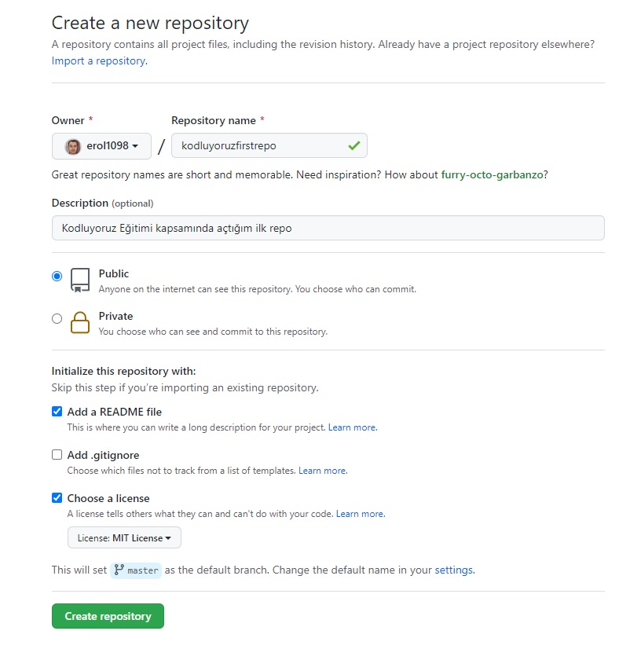

# Kodluyoruz First Repo

This repo [Kodluyoruz](https://www.kodluyoruz.org) is the first repo created for Front-End Training. It contains a README file and an index.html file.



## Installation

Firtsly, clone the project.

```bash
git clone https://github.com/erol1098/kodluyoruzilkrepo.git
```

## Usage

After cloning the project, open it with VS Code.

```bash
cd kodluyoruzilkrepo
code .
```

## Contributing

Pull requests will be accepted.

## License

[MIT](https://choosealicense.com/licenses/mit/)
